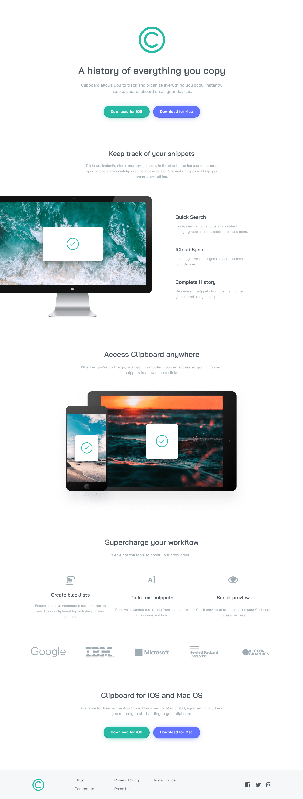

# Frontend Mentor - Clipboard landing page solution

This is a solution to the [Clipboard landing page challenge on Frontend Mentor](https://www.frontendmentor.io/challenges/clipboard-landing-page-5cc9bccd6c4c91111378ecb9). Frontend Mentor challenges help you improve your coding skills by building realistic projects. 

## Table of contents

- [Overview](#overview)
  - [The challenge](#the-challenge)
  - [Screenshot](#screenshot)
  - [Links](#links)
- [My process](#my-process)
  - [Built with](#built-with)
  - [What I learned](#what-i-learned)
  - [Continued development](#continued-development)
  - [Useful resources](#useful-resources)
- [Author](#author)
- [Acknowledgments](#acknowledgments)

## Overview

### The challenge

Users should be able to:

- View the optimal layout for the site depending on their device's screen size
- See hover states for all interactive elements on the page

### Screenshot



### Links

- Solution URL: [Solution](https://github.com/JustANipple/clipboard-landing-page/blob/master/style.css)
- Live Site URL: [Live site](https://justanipple.github.io/clipboard-landing-page/)

## My process

### Built with

- Semantic HTML5 markup
- CSS custom properties
- Flexbox
- CSS Grid
- Mobile-first workflow
- Josh's Custom CSS Reset
- Px to Rem converter
- Image color picker
- Logo color filtering

### What I learned

This was a huge challenge for me, but i learned a lot of things too!

1. I'm trying to get as close as possible to the design previews that come with the project starter folder. Not every color is mentioned in the styling guide, so i managed to get the active link and box shadow colors with color picker.
It's easy to use: i just upload the image and point to the pixel that contains the color that i need and i get the RGB of it
(See useful resources)

2. Starting with em has been a challenge too, but i found a way to convert pixels to em/rem that makes me thinking of pixels and then i can convert it fast to the unit i need. I don't know if this is the best approach, but i liked the result
(See useful resources)

3. The project came with social icons as well, but i had to make it change the color on hover. The easy way would've been to change these icons with some from fontAwesome and then change its color, but i didn't want to cheat it. Looking around for a solution i managed to find a web program that takes a color and prints a filter rule with everything set to change the SVG color. I pasted it and looks awesome
(See useful resources)

This is the result of the filter:

```css
.logo-facebook img:hover,
.logo-twitter img:hover,
.logo-instagram img:hover {
  filter: invert(63%) sepia(21%) saturate(1363%) hue-rotate(122deg) brightness(94%) contrast(87%);
  transition: filter 0.5s ease;
}
```

I couldn't do this by myself, so i'm glad that someone made a filter generator

### Continued development

Starting was the hardest part because i couldn't visualize the right way to organize blocks and which content place in them, so i wasted much time thinking where to start from.
Spacing and organizing a good HTML will be something to focus from now on

### Useful resources

- [Color-picker](https://imagecolorpicker.com - This gets a picture and makes you select the color you need. It's useful if you don't have the hover status colors in the style guide
- [Px to rem converter](https://nekocalc.com/px-to-rem-converter) - I used this to make a pixel spaced layout, but written with rems and ems to make it responsive
- [Filter generator](https://codepen.io/sosuke/pen/Pjoqqp) - With this i managed to change the SVG social icon colors on hover

## Author

- Frontend Mentor - [@JustANipple](https://www.frontendmentor.io/profile/JustANipple)

## Acknowledgments

Thanks to Sosuke for making a nice filter to change an SVG color from black to any HEX color! (https://codepen.io/sosuke)
